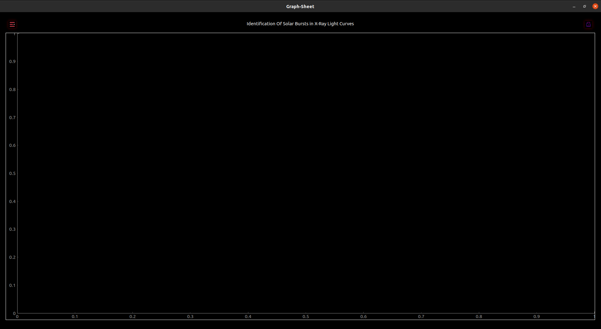

# isro-interiit

This program searches for solar flares in lightcurve data. The input is the lightcurve file in FITS, ASCII or XLS formats. The output is a visual representation of the identified solar flares along with some representative information for each. Specifications regarding input files can be found in [FILES.md](https://github.com/team19techmeet/isro-interiit/blob/main/FILES.md).

- [Installation](#installation)
- [Usage (Examples)](#usage)
    - [Web version](#web-version)
    - [Standalone app](#standalone-app)
- [Documentation](#documentation)

# Installation

## Install the web version

The web version can be run by executing

`pip install -r requirements.txt`

in the project directory. Then you need you need to run

`app.py`

from the same directory. You can now visit and use the tool at [http://127.0.0.1:5000](http://127.0.0.1:5000) on your browser.

## Install the standalone app

The standalone application can be installed by cloning the [git repository](https://github.com/team19techmeet/isro-interiit) and executing the [install.sh](https://github.com/team19techmeet/isro-interiit/blob/main/install.sh).

# Usage

Both the web and app versions have an easy to use and intuitive UI.

## Web version

Here we show how to use the web version of the software. For this example, we will use the sample lightcurve file [fits_data.lc](https://github.com/team19techmeet/isro-interiit/blob/main/sample_files/fits_data.lc) which is in the FITS format. Sample files for all supported formats are present inside the [sample_files](https://github.com/team19techmeet/isro-interiit/tree/main/sample_files) folder.

1. The homepage tells the user about the app and its function.

2. On scrolling down, the input form is revealed. The user can drag-and-drop the files onto the upload box or click upload to open the file explorer. The user can choose between FITS, ASCII and XLS file formats.

3. We upload the sample file and see the output. Here we chose the file in FITS format.

4. The output is a visual representation of the identified solar flares.

5. On scrolling, it shows other information about the flare, like the peak position, the rise and decay times of the flare, the duration and the peak flux.

> Time related info like peak time are given as miliseconds since the start of the data. For example, it the peak position is 60000 ms, it means the peak is present 1 minute from the starting of the data.

## Standalone app

Here we show how to use the standalone app. For this example, we will use a sample LC file from the [ISRO Pradaan website's](https://pradan.issdc.gov.in/pradan/) LC file, found inside the calibrated folder. We also use a corrupted file to show how error messages are displayed. Sample files for all supported formats are present inside the [sample_files](https://github.com/team19techmeet/isro-interiit/tree/main/sample_files) folder.

1. The main window has options to upload the required file types. Descriptions and specifications of the files can be found in [FILES.md](https://github.com/team19techmeet/isro-interiit/blob/main/FILES.md).

2. We upload the sample file and see the output. Here we chose the file in FITS format.

3. If the file is found to be corrupted, the user is notified.

4. The output is a visual representation of the identified solar flares.

> Clicking the top left button lists each identified flare. Clicking on each shows the flare's details which include peak position, rise and decay times of the flare, the duration and the peak flux.

# Documentation

Detailed documentation can be found in [DOCUMENTATION.md](https://github.com/team19techmeet/isro-interiit/blob/main/DOCUMENTATION.md).

# Accuracy and reliability

Since no labelled data was provided to us, no number for accuracy and reliability can be shown. However, we have tested the software on a few datasets and it seems to work well.

Our confidence in this model stems from our approach. We used a robust error removal procedure to smoothen the curve and bring it near ground truth.

After that the fit parameters we used were extensively fine-tuned based on several sample datasets. We prioritized false positives to false negatives.

In other words, even if the algorithm can sometimes find a false positive, it will very rarely find a false negative. This means almost no real flare will be missed.

Our reasoning and explanation for choosing the fit parameters is detailed in [DOCUMENTATION.md](https://github.com/team19techmeet/isro-interiit/blob/main/DOCUMENTATION.md).